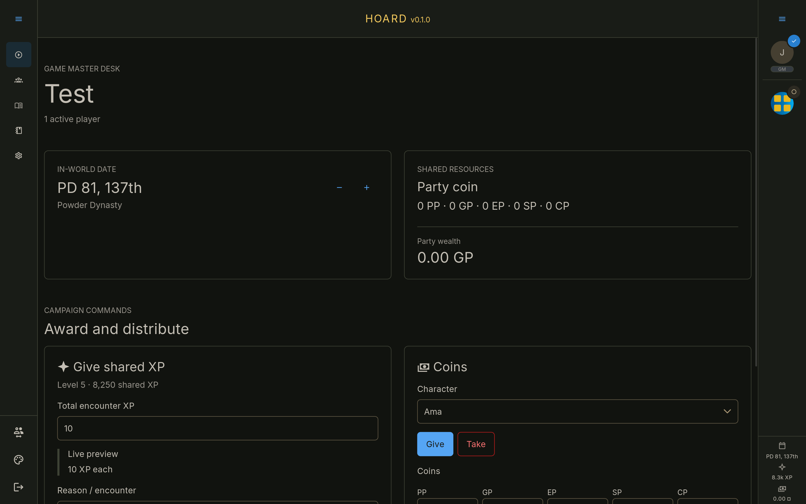
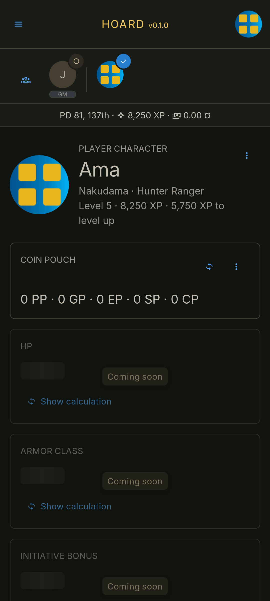

# Hoard

Hoard is a small campaign companion for shared XP, coin ledgers, calendar tracking,
character profiles, invitations, and campaign administration.

## Screenshots

### Desktop



### Mobile

<p align="center">
  
</p>

## Current release

Hoard `0.1.0` focuses on the shared campaign tools that are ready for regular use:

- shared XP for active player characters, including level progress and immutable
  ledger history;
- personal and campaign coin accounts with grants, spending, transfers, exact-value
  exchanges, and reversals;
- a campaign calendar whose date is recorded against ledger and audit events;
- player-character and NPC profiles with portraits, free-text race and class, and
  profile editing;
- campaign membership, shareable invitations, roster management, and GM controls;
- a responsive campaign shell with live WebSocket updates and desktop/mobile party
  navigation.

Character profiles retain the full sheet layout as a preview of planned features.
Unavailable statistics, abilities, skills, inventory, equipment, and character-detail
sections are clearly marked **Coming soon** and use skeleton values rather than
placeholder character data. The Compendium is likewise visible in navigation but is
not part of this release.

## Development

Docker Compose is the supported full-stack development workflow. It starts Daphne,
Vite with live reload, PostgreSQL, and Redis with persistent local volumes:

```sh
docker compose -f compose.dev.yml up --build
```

Open `http://localhost:5173`. Vite proxies HTTP uploads, media, the release manifest,
and WebSockets to Daphne. Django is also available directly at
`http://localhost:8000`.

The application container applies migrations when it starts. To run checks in a
second terminal:

```sh
docker compose -f compose.dev.yml exec app uv run pytest --reuse-db
docker compose -f compose.dev.yml exec app uv run ruff check hoard
docker compose -f compose.dev.yml exec frontend npm test
docker compose -f compose.dev.yml exec frontend npm run build
```

Stop the stack without deleting its database or uploaded portraits:

```sh
docker compose -f compose.dev.yml down
```

Add `--volumes` only when intentionally recreating the unsupported pre-release
database and all local uploads.

## Production

Production runs Daphne, Celery, PostgreSQL, Redis, and Nginx. Nginx serves static
assets and uploaded media directly. Traefik routes application HTTP and WebSocket
traffic straight to Daphne, while sending `/static/` and `/media/` requests to
Nginx.

Create the external network and local production environment file once:

```sh
docker network create web
cp .env.example .env
```

Set a long random `DJANGO_SECRET_KEY` and a strong `POSTGRES_PASSWORD` in `.env`,
then build and start the deployment for `https://dnd.turnr.net`:

```sh
docker compose up -d --build
```

Compose loads `.env` automatically. Database names and users can be changed with
`POSTGRES_DB` and `POSTGRES_USER`. Persistent production data is stored below
`/data/appdata/hoard`.

To inspect status and logs:

```sh
docker compose ps
docker compose logs -f app worker nginx
```

## Architecture

- Django owns authentication, campaign data, portrait uploads, and the initial SPA
  response. Nginx serves uploaded media directly in production.
- Application queries and commands use authenticated WebSockets. HTTP is limited to
  session/CSRF operations, portrait uploads, static/media delivery, and the release
  manifest.
- Redis carries campaign broadcasts, cache data, and Celery messages.
- PostgreSQL stores the campaign, audit, money, and XP ledgers.
- Vue and PrimeVue provide the browser application; Vite builds its production
  assets into `hoard/dist`.

See [the API guide](docs/api.md) and [the initial release brief](docs/initial-release.md)
for the protocol and release scope.

## Local tool shell

Running `nix-shell` provides Python 3.14, uv, Node.js, npm, Git, and Docker Compose.
Docker Compose remains the supported way to run the full stack; the shell is useful
for repository checks and maintenance.

## AI policy

Listen here, I'm a software dev, have been making Django apps since before you were
even a stain on your parents bedsheets. I'm taking assistance to speed things up,
and I don't care.
